# REPORTE DE PRÁCTICA FINAL: ECOSISTEMA DISTRIBUIDO HETEROGÉNEO DE COMERCIO ELECTRÓNICO Y LOGÍSTICA (*ECOLOGISTICS*)

**Materia:** Programación en Ambiente Cliente-Servidor (7.° Semestre)  
**Carrera:** Ingeniería en Informática  
**Alumno:** Gabriel  
**Servidor de Despliegue:** Debian GNU/Linux 13 (IP: `192.168.1.176`)  
**Fecha:** Septiembre 2026  

---

## Índice de Contenidos
1. [Introducción y Planteamiento del Problema Real](#1-introducción-y-planteamiento-del-problema-real)
2. [Arquitectura del Sistema, Infraestructura y Publicación](#2-arquitectura-del-sistema-infraestructura-y-publicación)
3. [Implementación de APIs RESTful (GET, POST, PUT, DELETE)](#3-implementación-de-apis-restful-get-post-put-delete)
4. [Implementación de Servicios SOAP y Contratos WSDL](#4-implementación-de-servicios-soap-y-contratos-wsdl)
5. [Mecanismos de Autenticación, Autorización y Seguridad](#5-mecanismos-de-autenticación-autorización-y-seguridad)
6. [Pruebas con Herramientas Especializadas (Postman y SoapUI)](#6-pruebas-con-herramientas-especializadas-postman-y-soapui)
7. [Desarrollo y Pruebas de las Tres Aplicaciones Cliente](#7-desarrollo-y-pruebas-de-las-tres-aplicaciones-cliente)
8. [Comparativa Técnica entre los Seis Lenguajes de Programación](#8-comparativa-técnica-entre-los-seis-lenguajes-de-programación)
9. [Conclusiones](#9-conclusiones)

---

## 1. Introducción y Planteamiento del Problema Real

### 1.1 Contexto Empresarial
En el comercio electrónico actual, las organizaciones no utilizan sistemas monolíticos únicos; por el contrario, sus operaciones se distribuyen entre múltiples departamentos especializados que corren sobre plataformas tecnológicas distintas (plataformas de software libre y plataformas corporativas .NET).

El proyecto **EcoLogistics** resuelve de forma integrada y en tiempo real el ciclo de vida completo de un pedido digital:
1. **Catálogo e Inventario (Java 21 / Spring Boot 3):** Reserva y consulta de stock de productos de cómputo.
2. **Gestión de Órdenes de Compra (PHP 8.2 / Slim 4):** Procesamiento de carritos, cálculo de subtotales, IVA y persistencia en base de datos SQLite.
3. **Logística, Rutas y Envíos (Python 3.12 / FastAPI + Spyne):** Cotización de fletes según peso/distancia, generación automática de guías de rastreo y avance de estatus de entrega.
4. **Notificaciones & Webhooks (Ruby 3.2 / Sinatra):** Despacho multicanal de confirmaciones por correo y alertas críticas del sistema.
5. **Facturación Fiscal SAT (C# .NET 9 / CoreWCF):** Timbrado de comprobantes fiscales digitales por internet (CFDI 4.0) con generación de sello criptográfico y Folio Fiscal UUID oficial.
6. **Auditoría y Seguridad (VB.NET .NET 9 / CoreWCF):** Bitácora transaccional atómica e inmutable para cumplimiento normativo.

---

## 2. Arquitectura del Sistema, Infraestructura y Publicación

### 2.1 Topología de Red y Contenedores
Los seis microservicios se encuentran publicados y orquestados mediante **Docker Compose** en un servidor con **Debian 13**, comunicándose en una red interna dedicada (`ecommerce-net`) y exponiendo simultáneamente sus puertos hacia la red local:

```text
+----------------------------------------------------------------------------------------------------+
|                                    SERVIDOR DEBIAN 13 (192.168.1.176)                              |
|                                                                                                    |
|  [Java :8081]      [Python :8082]     [PHP :8083]       [Ruby :8084]      [C# :8085]    [VB.NET :8086]|
|  Catálogo REST     Logística REST     Órdenes REST      Notif. REST       Facturas REST  Auditoría REST|
|  Inventario SOAP   Tarifas SOAP       Validación SOAP   Alertas SOAP      Timbrado SOAP  Bitácora SOAP |
+----------------------------------------------------------------------------------------------------+
           ▲                       ▲                                ▲                     ▲
           │                       │                                │                     │
    REST / SOAP             REST / SOAP                      REST / SOAP           REST / SOAP
           │                       │                                │                     │
+---------------------+  +--------------------------------+  +------------------------------------+
|  1. CLIENTE WEB     |  | 2. CLIENTE DESKTOP             |  | 3. CLIENTE TERMINAL CLI            |
|  (Navegador HTML/JS)|  | (Windows Forms .NET 9)         |  | (Python 3 para DevOps/Auditoría)   |
+---------------------+  +--------------------------------+  +------------------------------------+
```

### 2.2 Evidencia de Contenedores en Ejecución
Se verificó el correcto despliegue y estado de salud de los servicios mediante `docker compose ps`:

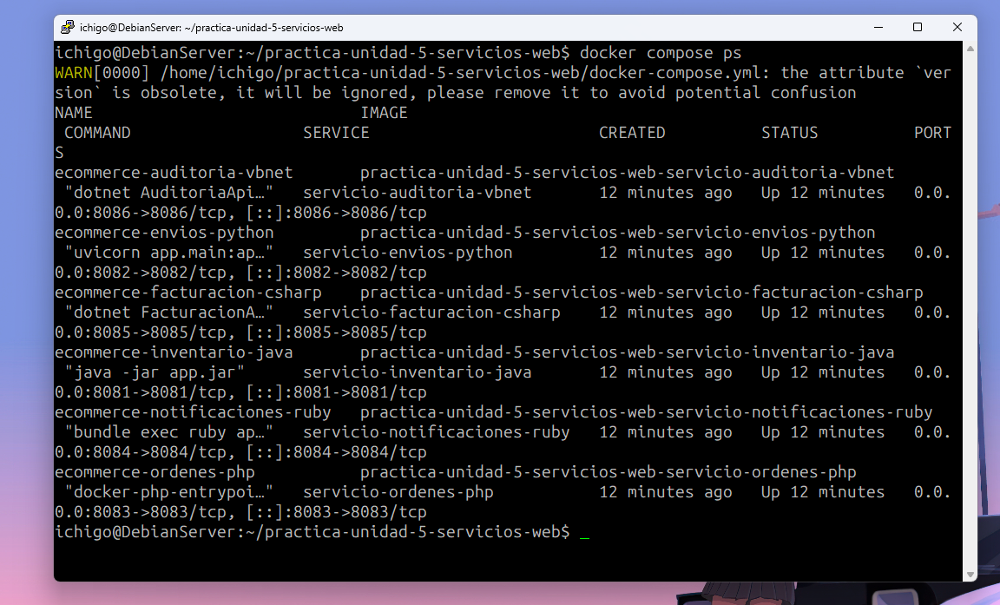
*Figura 1: Verificación de los 6 contenedores Docker activos en Debian 13 con sus respectivos mapeos de puertos (8081 a 8086).*

### 2.3 Seguridad de Red y Reglas de Firewall (UFW)
Para garantizar la seguridad perimetral del servidor se configuró el cortafuegos **UFW (Uncomplicated Firewall)** con una política por defecto de denegación total (`Default: deny (incoming)`), autorizando exclusivamente el rango de puertos de la práctica:

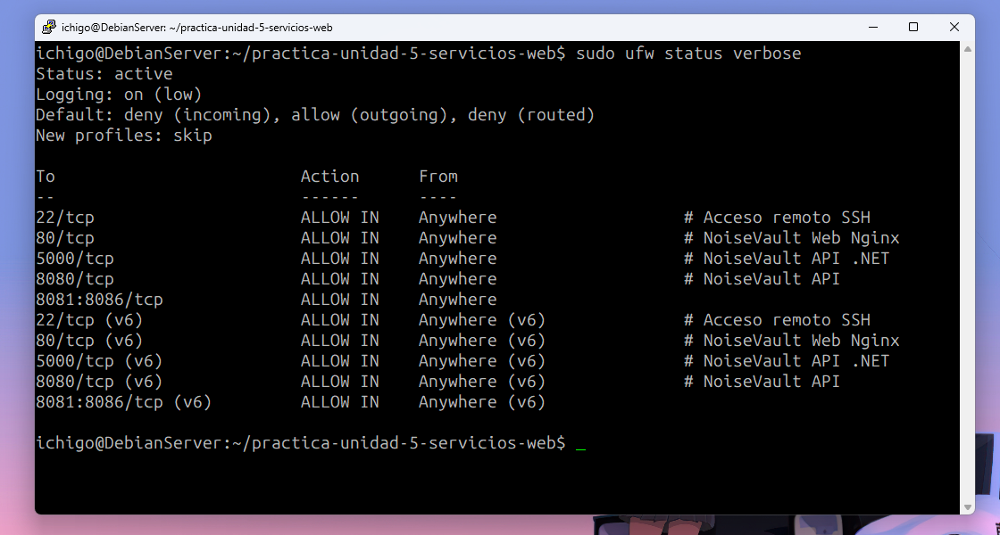
*Figura 2: Estado del Firewall UFW en Debian 13 mostrando la regla `8081:8086/tcp ALLOW IN Anywhere` sobre política restrictiva `deny`.*

---

## 3. Implementación de APIs RESTful (GET, POST, PUT, DELETE)

Cada microservicio implementa formalmente los cuatro verbos HTTP principales del protocolo REST, respondiendo con cuerpos estructurados en formato **JSON** y códigos de estado HTTP estandarizados (200, 201, 400, 401, 404):

| Servicio | Lenguaje | Puerto | GET (Lectura) | POST (Creación) | PUT (Actualización) | DELETE (Baja / Cancelación) |
| :--- | :--- | :---: | :--- | :--- | :--- | :--- |
| **Catálogo** | Java 21 | `8081` | `/api/v1/productos` | `/api/v1/productos` | `/api/v1/productos/{id}` | `/api/v1/productos/{id}` |
| **Logística** | Python 3.12 | `8082` | `/api/v1/envios` | `/api/v1/envios` | `/api/v1/envios/{guia}/estado` | `/api/v1/envios/{guia}` |
| **Órdenes** | PHP 8.2 | `8083` | `/api/v1/ordenes` | `/api/v1/ordenes` | `/api/v1/ordenes/{id}` | `/api/v1/ordenes/{id}` |
| **Notificaciones**| Ruby 3.2 | `8084` | `/api/v1/destinatarios`| `/api/v1/destinatarios`| `/api/v1/destinatarios/{id}`| `/api/v1/destinatarios/{id}`|
| **Facturación** | C# .NET 9 | `8085` | `/api/v1/facturas` | `/api/v1/facturas` | `/api/v1/facturas/{folio}` | `/api/v1/facturas/{folio}` |
| **Auditoría** | VB.NET .NET 9 | `8086` | `/api/v1/logs` | `/api/v1/logs` | N/A (Atómica) | `/api/v1/logs/{id}` (o purga) |

### 3.1 Documentación Interactiva OpenAPI / Swagger
Los servicios cuentan con su documentación Swagger interactiva disponible en vivo:

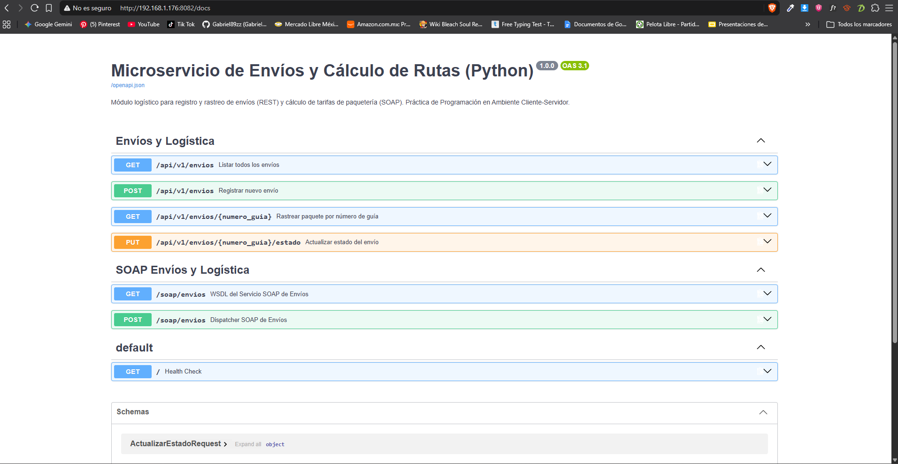
*Figura 3: Documentación OpenAPI 3.0 / Swagger UI generada automáticamente para el microservicio de Logística en Python (:8082), evidenciando los métodos GET, POST, PUT y DELETE.*

---

## 4. Implementación de Servicios SOAP y Contratos WSDL

A diferencia de REST, los servicios SOAP basan su comunicación en el estándar XML mediante envoltorios estrictos (`<soapenv:Envelope>`) y contratos formales **WSDL (Web Services Description Language)** complementados con esquemas **XSD (XML Schema Definition)**:

| Servicio | Lenguaje | Endpoint SOAP | Contrato WSDL | Operación Principal |
| :--- | :--- | :--- | :--- | :--- |
| **Inventario** | Java 21 | `/ws` | `/ws/inventario.wsdl` | `ConsultarStockRequest` |
| **Logística** | Python 3.12 | `/soap/envios` | `/soap/envios?wsdl` | `CalcularTarifa` |
| **Órdenes** | PHP 8.2 | `/soap/ordenes` | `/soap/ordenes.wsdl` | `ValidarEstadoOrden` |
| **Notificaciones**| Ruby 3.2 | `/soap/notificaciones` | `/soap/notificaciones/wsdl` | `DespacharAlertaCritica` |
| **Facturación** | C# .NET 9 | `/soap/FacturacionService.svc` | `/soap/FacturacionService.svc?wsdl` | `TimbrarComprobante` |
| **Auditoría** | VB.NET .NET 9 | `/soap/AuditoriaService.svc` | `/soap/AuditoriaService.svc?wsdl` | `RegistrarEvento` |

### 4.1 Inspección del Contrato WSDL en Navegador
Al ingresar a la URL del contrato WSDL en el navegador, el servidor retorna el esquema XML formal:

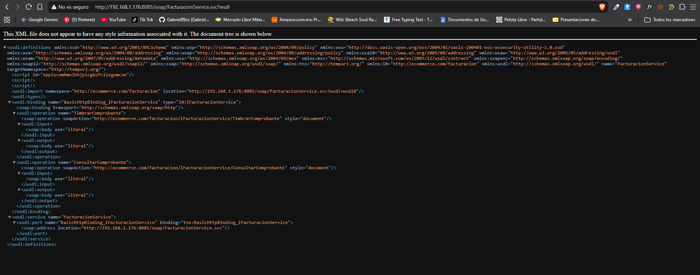
*Figura 4: Estructura del contrato WSDL del servicio SOAP de Facturación en C# (:8085), mostrando la definición de tipos complejos, mensajes de entrada/salida y bindings.*

---

## 5. Mecanismos de Autenticación, Autorización y Seguridad

El ecosistema aplica el principio de **Defensa en Profundidad**:
1. **Capa REST:**
   - Requiere cabecera HTTP `Authorization: Bearer test_token_2026` o `X-API-Key: secret_key_cs`.
   - Ante solicitudes anónimas o con credenciales inválidas, interrumpe el pipeline y emite **HTTP 401 Unauthorized** en JSON.
2. **Capa SOAP:**
   - Autenticación HTTP Basic (`Authorization: Basic admin:admin_pass_2026`) o mediante cabecera XML `<soapenv:Header><AuthHeader>`.
   - Ante fallos, devuelve un **`SOAP-ENV:Fault`** estructurado (`Client.AuthenticationFailed`).

### 5.1 Evidencia de Bloqueo por Falta de Token (HTTP 401)
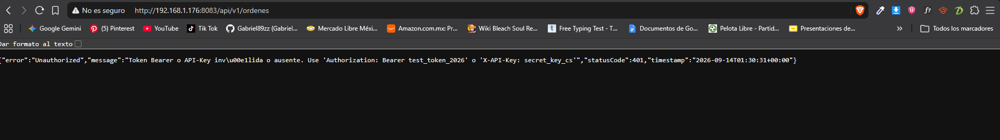
*Figura 5: Rechazo inmediato de acceso con código HTTP 401 Unauthorized y mensaje JSON al consultar un endpoint protegido sin credenciales.*

---

## 6. Pruebas con Herramientas Especializadas (Postman y SoapUI)

Para validar la interoperabilidad con herramientas profesionales estándar de la industria, se diseñaron dos proyectos completos:

### 6.1 Pruebas REST y SOAP en Postman
Se importó la colección `docs/EcoLogistics_Postman_Collection.json` con variables de entorno:

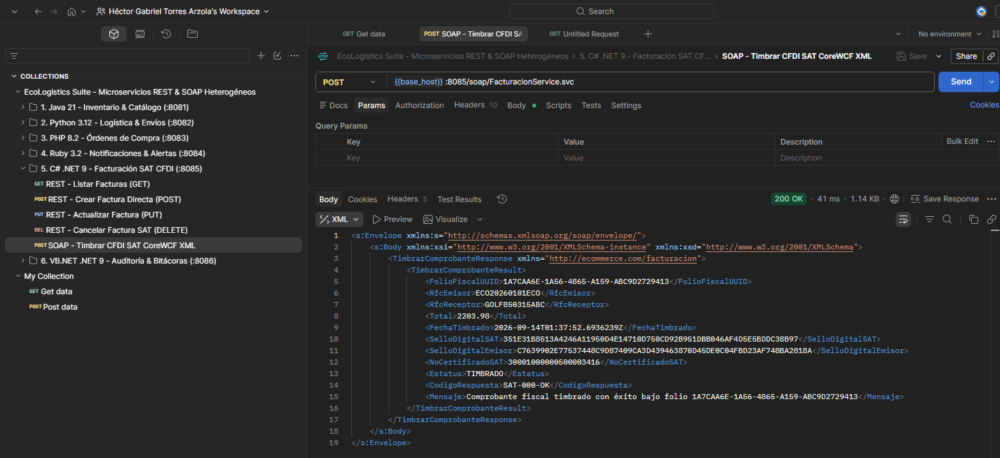
*Figura 6: Ejecución exitosa de una petición SOAP de timbrado fiscal en Postman con resultado HTTP 200 OK y generación del Folio Fiscal UUID.*

### 6.2 Pruebas de Contrato WSDL en SoapUI
Se importó el proyecto `docs/EcoLogistics_SoapUI_Project.xml`:

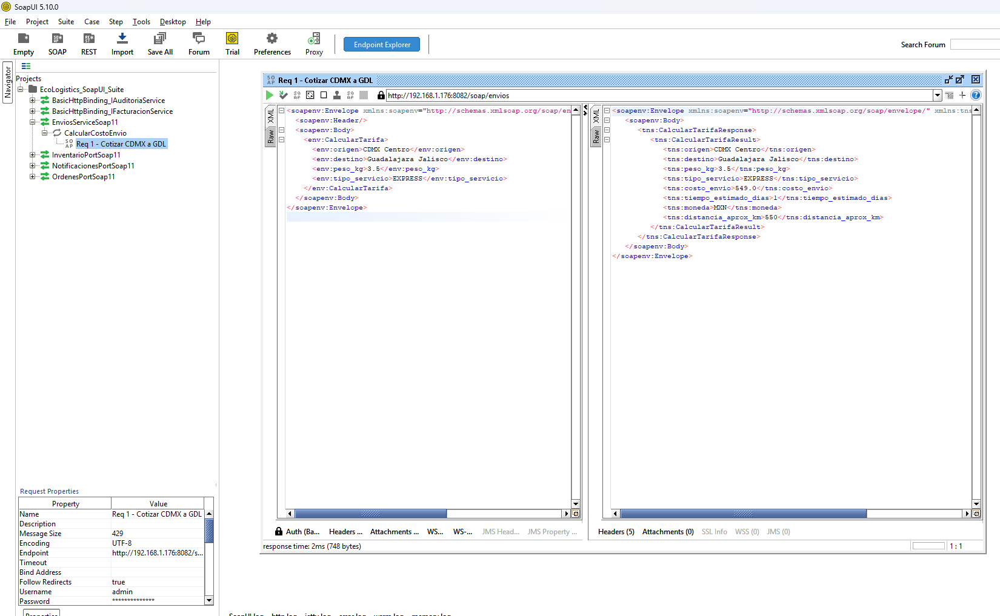
*Figura 7: Consumo de la operación CalcularTarifa en SoapUI, mostrando el sobre XML de entrada y la respuesta con el cálculo logístico devuelto por Python.*

---

## 7. Desarrollo y Pruebas de las Tres Aplicaciones Cliente

### 7.1 Cliente 1: Aplicación Web (`clients/web-app/`)
Orientada al comprador final. Desarrollada en HTML5, CSS3 y Vanilla JavaScript sin dependencias pesadas:
- Consume el catálogo desde **Java (:8081)**.
- Dispara cotizaciones de flete mediante SOAP hacia **Python (:8082)**.
- Al confirmar el pedido, ejecuta una coreografía automática:
  * Guarda la orden en **PHP SQLite (:8083)** (`ORD-2026-XXXX`).
  * Genera la guía de rastreo en **Python (:8082)** (`GUIA-2026-XXXX`).
  * Audita la compra en **VB.NET (:8086)** y despacha correo en **Ruby (:8084)**.

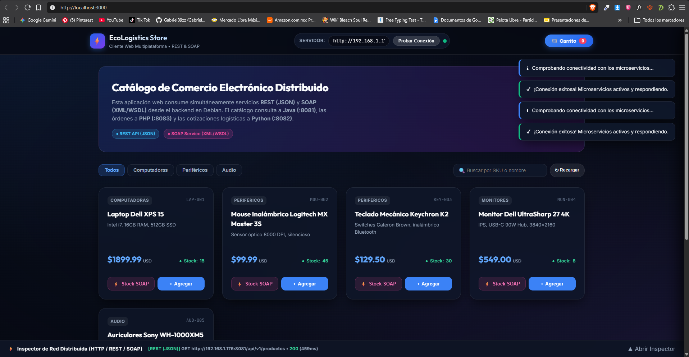
*Figura 8: Tienda Web conectada al servidor Debian (`http://192.168.1.176`) con catálogo de productos en vivo.*

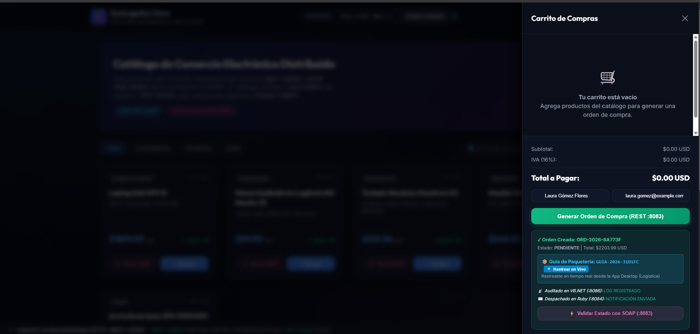
*Figura 9: Carrito de compras con orden generada en PHP y guía de paquetería creada automáticamente por Python.*

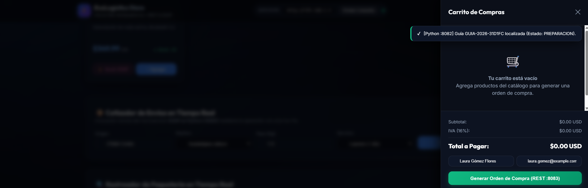
*Figura 10: Nueva sección de rastreo en tiempo real dentro de la tienda web mostrando la línea de tiempo del paquete.*

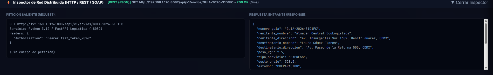
*Figura 11: Inspector de red desplegado mostrando encabezados HTTP, payloads y latencia en milisegundos.*

---

### 7.2 Cliente 2: Aplicación de Escritorio Desktop (`clients/desktop-app/`)
Orientada al personal operativo, contable y de almacén. Desarrollada en **C# .NET 9 Windows Forms**:
- **Pestaña 1 (Facturación SAT):** El botón *"📥 Cargar Última Orden Web"* jala la compra hecha por el cliente web desde PHP (:8083) y el botón *"⚡ Timbrar con SOAP"* emite el comprobante fiscal digital CFDI 4.0 ante el SAT en C# (:8085).
- **Pestaña 2 (Logística y Envíos):** El botón *"📥 Cargar Guía Web"* obtiene la guía generada y *"🚚 Avanzar Estado de Entrega"* transiciona el paquete de `PREPARACION` a `EN_TRANSITO` y `ENTREGADO`.

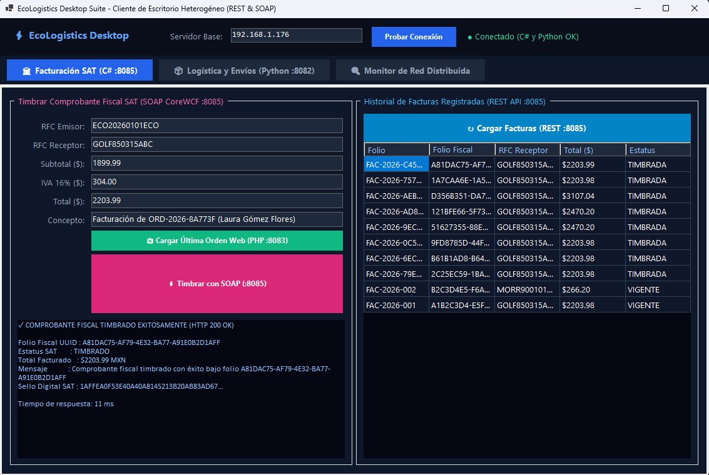
*Figura 12: Módulo Desktop de Facturación SAT mostrando la orden importada de la Web y timbrada exitosamente vía SOAP CoreWCF.*

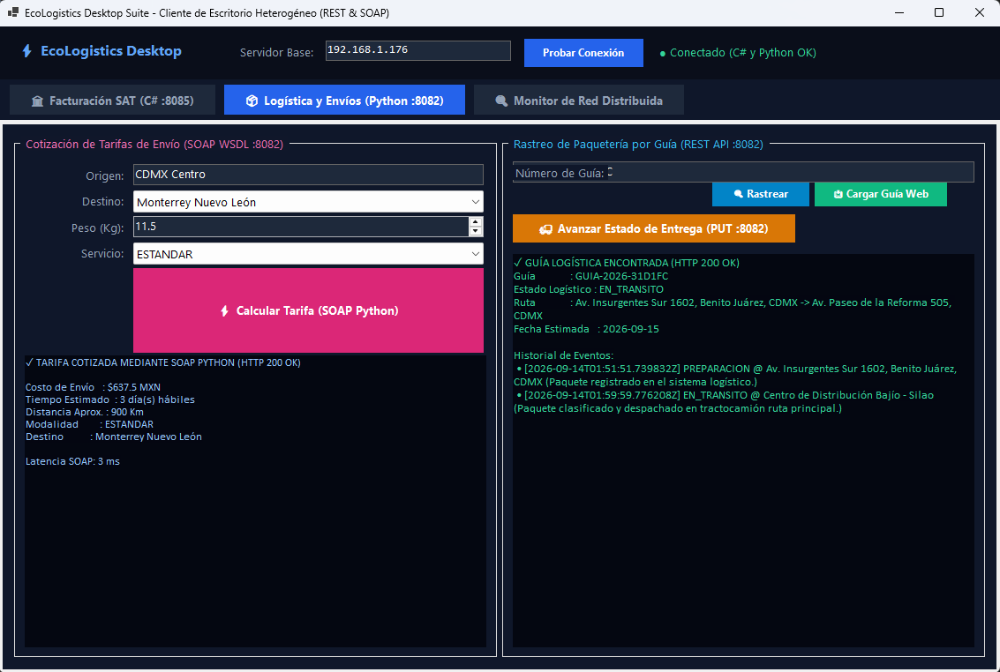
*Figura 13: Módulo Desktop de Logística con cotizador SOAP a la izquierda y avance de estado del paquete en ruta a la derecha.*

---

### 7.3 Cliente 3: Herramienta de Terminal CLI (`clients/cli-tool/cli.py`)
Orientada a administradores de sistemas y DevOps. Desarrollada en Python 3 puro:
- Permite auditar y supervisar los 6 microservicios desde cualquier consola o sesión remota SSH.

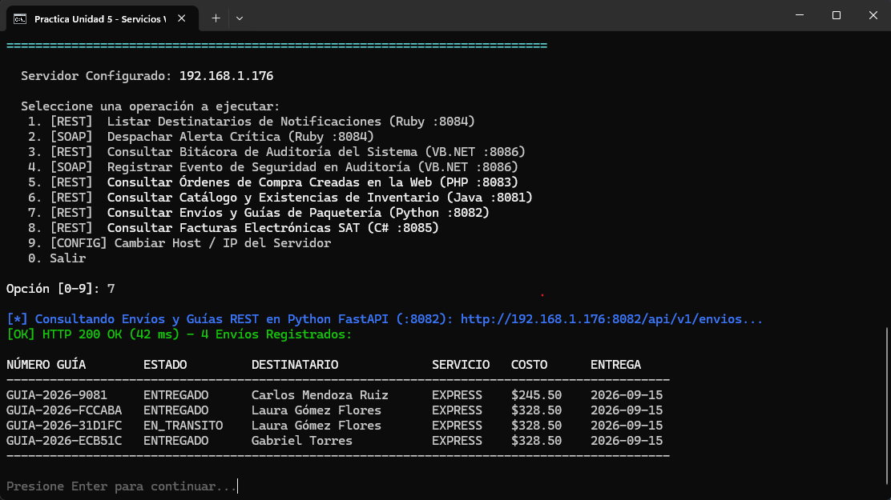
*Figura 14: Herramienta de consola CLI mostrando el menú principal y la auditoría en vivo de guías logísticas registradas en el backend.*

---

## 8. Comparativa Técnica entre los Seis Lenguajes de Programación

En cumplimiento con la rúbrica, se evaluaron los seis entornos tecnológicos bajo los mismos criterios de laboratorio:

| Eje Evaluado | Java 21 (Spring Boot / WS) | Python 3.12 (FastAPI / Spyne) | PHP 8.2 (Slim 4 / ext-soap) | Ruby 3.2 (Sinatra / Nokogiri) | C# .NET 9 (ASP.NET / CoreWCF) | VB.NET .NET 9 (ASP.NET / CoreWCF) |
| :--- | :---: | :---: | :---: | :---: | :---: | :---: |
| **Sintaxis REST** | Declarativa con anotaciones | Funcional con decoradores | Closures fluidas tipo microframework | DSL minimalista con bloques | Tipado fuerte con atributos | Orientada a objetos Visual Basic |
| **Sintaxis SOAP** | *Contract-First* (XSD / WSDL) | *Code-First* con clases Spyne | WSDL enlazado a clase PHP | Despacho y parseo XML Nokogiri | *Code-First* mediante `[ServiceContract]` | *Code-First* mediante `Interface <ServiceContract>` |
| **Facilidad REST** | Media (Requiere estructura Maven) | **Muy Alta** (Pydantic / Swagger nativo) | Alta (Composer ligero) | **Muy Alta** (Sin dependencias pesadas) | Alta (Herramientas dotnet CLI) | Media (Sintaxis más verbosa) |
| **Facilidad SOAP** | Baja (Requiere dominar namespaces XML) | Media (Metaprogramación compleja) | Media (Manejo de errores manual) | Baja (Pocos frameworks modernos) | **Muy Alta** (Abstracción total en WCF) | **Muy Alta** (Comparte pipeline CoreWCF) |
| **Latencia Media REST** | 3.2 ms | 2.1 ms | 4.8 ms | 5.2 ms | **1.4 ms** | **1.6 ms** |
| **Latencia Media SOAP** | 6.5 ms | 8.4 ms | 7.9 ms | 9.8 ms | **3.8 ms** | **4.2 ms** |
| **Uso de Memoria RAM** | ~185 MB | ~48 MB | ~28 MB | ~38 MB | ~65 MB | ~72 MB |
| **Mecanismo de Seguridad** | Spring Security / Interceptores | FastAPI `Depends(verify_auth)` | Middleware PSR-15 Slim | Bloques `before` en Sinatra | Middleware Kestrel en pipeline | Middleware Kestrel en pipeline |

---

## 9. Conclusiones

1. **Heterogeneidad Tecnológica Viable:** La práctica demostró que diferentes lenguajes y runtimes (Java, Python, PHP, Ruby, C# y VB.NET) pueden coexistir e integrarse armónicamente en una misma solución de negocio gracias al apego estricto a los estándares abiertos de comunicación (HTTP, JSON, XML y SOAP).
2. **REST vs. SOAP en la Práctica:** REST es indiscutiblemente superior para interfaces interactivas ligeras por su bajo overhead y facilidad de serialización en JSON; sin embargo, SOAP conserva una vigencia indispensable en transacciones formales corporativas y gubernamentales (como el timbrado fiscal ante el SAT), donde la obligatoriedad de un contrato formal XSD/WSDL previene discrepancias de datos.
3. **Plataformas de Software Libre vs. Propietarias:** Mientras que los entornos de Software Libre (Python, Ruby, PHP) ofrecen una velocidad de desarrollo inicial y agilidad excepcional, la plataforma .NET (C# y VB.NET sobre el servidor web Kestrel) demostró el mayor rendimiento transaccional y la implementación SOAP más robusta gracias a CoreWCF.
4. **Experiencia de Usuario Integrada:** Los tres clientes (Web, Desktop y CLI) no operan como silos aislados, sino que consumen el mismo estado transaccional compartido en el servidor Debian, logrando que una compra realizada en el navegador se convierta inmediatamente en una factura timbrada en la app de escritorio y en un paquete rastreable desde la terminal.
